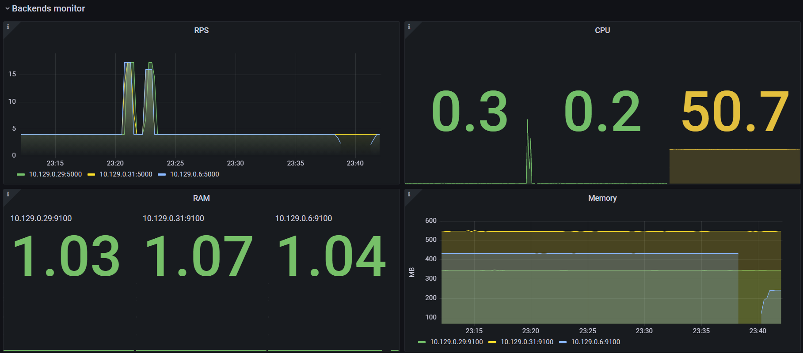

# L4 балансировщик нагрузки на Nginx с тестированием
- Поднято три бэкенда с базой данных, [репозиторий бэкенда](https://github.com/SergTyapkin/DB-forums)
- Налажен сбор метрик с помощью Grafana+Prometeus
- Сконфигурирован L4 балансировщик нагрузки на Nginx
- Нагрузка осуществляется с помощью специальной программы `technopark-dbms-forum.exe` [её репозиторий](https://github.com/mailcourses/technopark-dbms-forum), а также [Apache Benchmark](https://httpd.apache.org/docs/current/programs/ab.html)

---
1. Даём нагрузку

2. Даём больше нагрузки

3. Отключаем один бэкенд

4. Подключаем бэкенд обратно
   

### Итог: балансировщик работает

